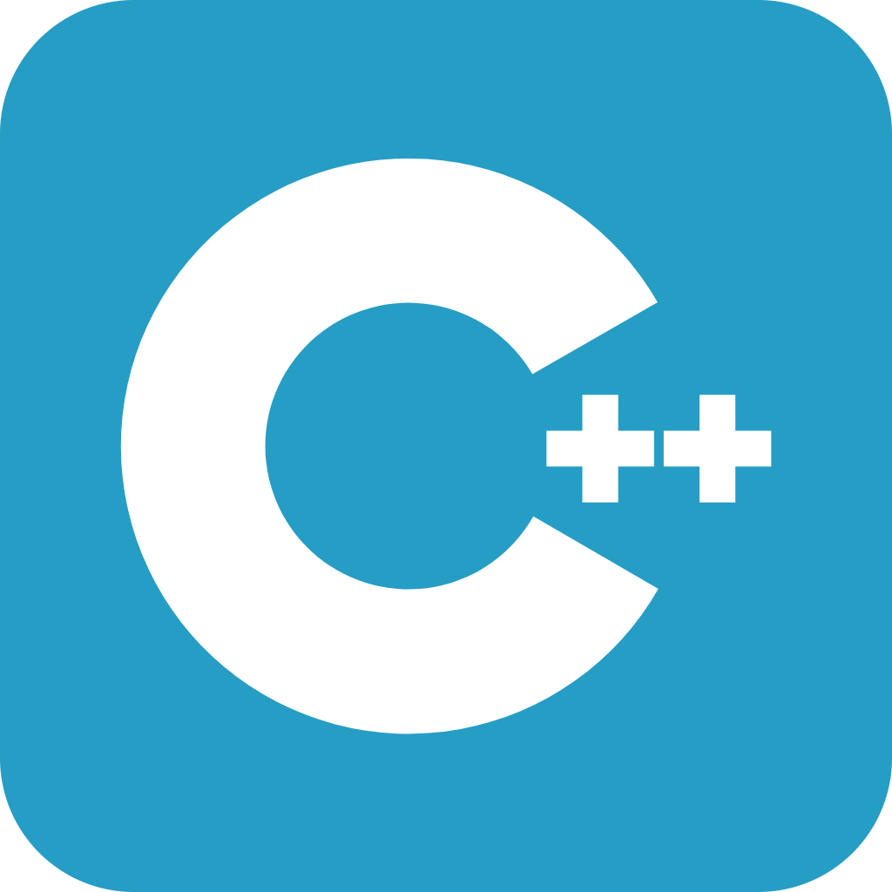
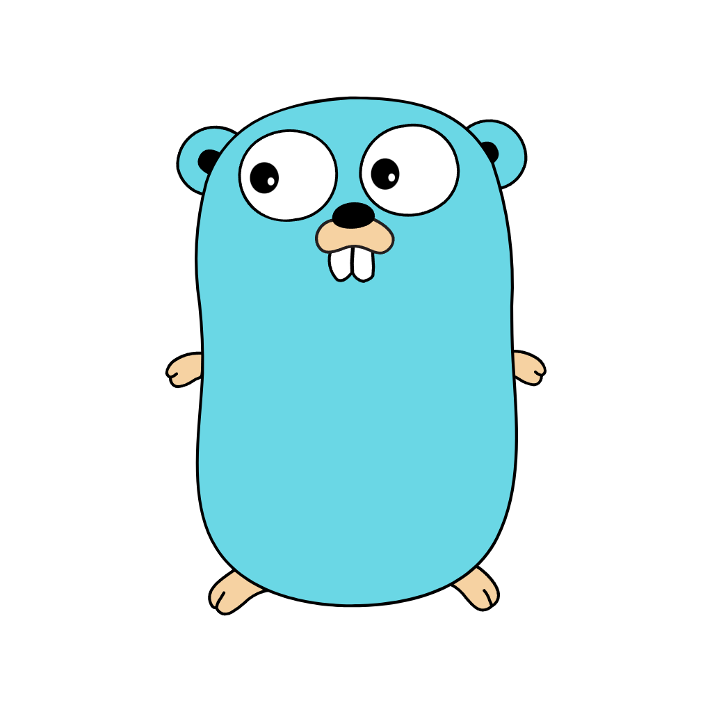
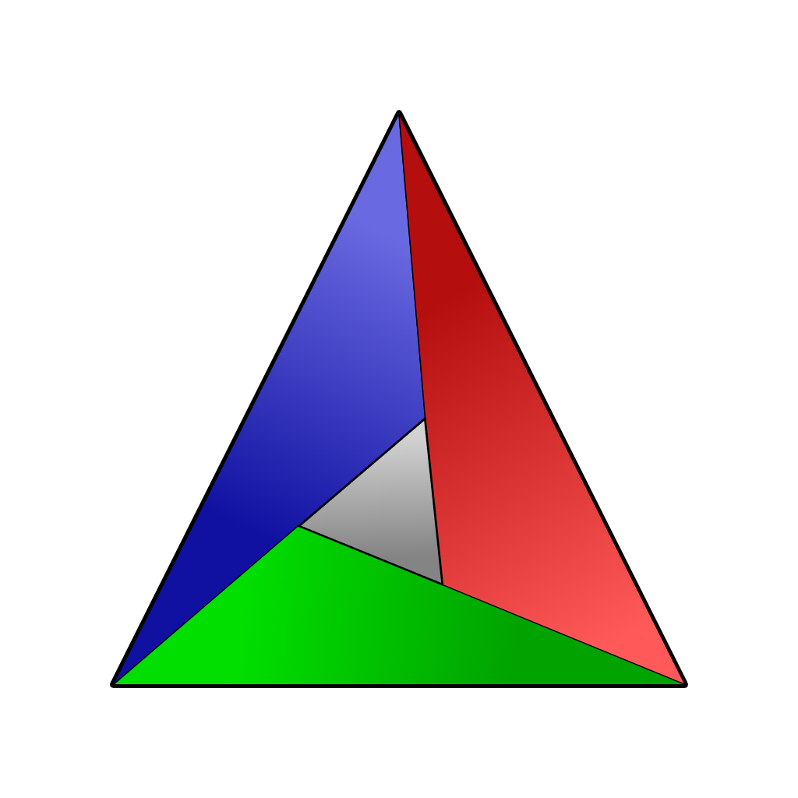

Hi 👋, My name is Egor
=============

<h4>
    I'm 👨‍💻Java Developer & Software Engineer and I like to:
</h4>

- writing high-load applications
- working with cybersecurity systems
- write clean and understandable code

<h4>
  I'm currently working on a personal project 🚀  
  I'm open to collaborating 🤝
</h4>

<h3 align="left">Connect with me</h3>

    
    
    

<h3 align="left">Languages</h3>

    
    
    
    

<h3 align="left">Tools</h3>

    
    
    
    
    
    
    
    
    
    

<h3>Statistic</h3>

 
    
        

